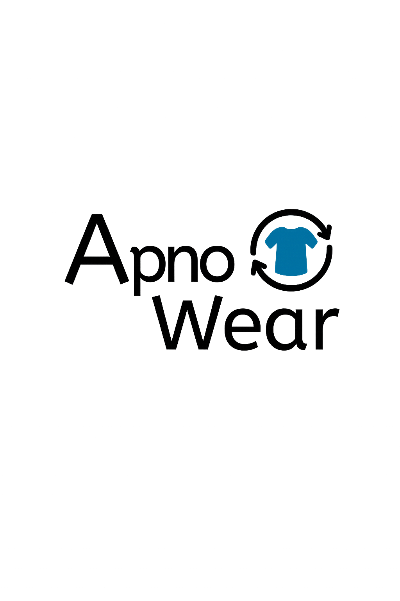

<h1 align="center">
  <br>
  <b>ApnoWear 👗♻️</b>
</h1>
<p align="center">
  <i>Sustainable Fashion Starts With You</i><br>
  Team 2531 — ReWear: Community Clothing Exchange
</p>

---

### 🌟 Overview

**ApnoWear** is a stylish and eco-conscious platform designed to reduce textile waste by allowing users to **swap** or **redeem** clothes using a point system. Built with a community-first mindset, we aim to **promote reuse** and support a **circular economy**.

---

### 🚀 Demo Video

🎥 [Watch the Demo](https://youtu.be/usAoFGzeSZo)  
📷 

---
"""" Database 
[Watch the Demo](https://youtu.be/o2FQM2VzWkw) 
### 💎 Features

✨ **Authentication** – Secure login/signup with email-password.  
🛍 **Item Listing** – Upload item images, tags, sizes, and category.  
🧾 **Dashboard** – View profile, points, listed items, and history.  
🔄 **Swapping System** – Trade clothes or redeem via point balance.  
🛡 **Admin Panel** – Manage listings, approve/reject items.  
🌱 **Eco-Focused** – Built to promote sustainable fashion choices.

---

### 🛠 Tech Stack

- 🧠 **Backend:** Python, Django
- 🎨 **Frontend:** HTML, CSS, JavaScript
- 💾 **Database:** PostgreSql
- 🔌 **API:** Django REST Framework
- 🔐 **Auth:** Django’s built-in auth

---

### 🧰 Setup & Installation

```bash
# Clone project
git clone <your_repo_link>
cd ApnoWear/App

# Create virtual environment
python -m venv venv
venv\Scripts\activate  # Windows

# Install dependencies
pip install -r requirements.txt

# Migrate database
python manage.py makemigrations
python manage.py migrate

# Run backend
python manage.py runserver
```

#### Frontend (Static)
Open `frontend/index.html` in your browser to preview the UI.

---

### 🧑‍💼 Usage Flow

1. ✅ **Register/Login** – Create your account.
2. 👀 **Browse** – View available clothing items.
3. 📤 **List Items** – Upload items for trade.
4. 🔄 **Swap/Redeem** – Use points or swap directly.
5. 📊 **Dashboard** – Manage your activity and track progress.

---

### 📸 Screenshots

#### 🎯 Target Audience


#### 🔁 Circular Economy Model


#### 📈 Fashion Market Stats


---

### 🧑‍💻 Contributing

We welcome your contributions!

```bash
# Fork and clone
git checkout -b new-feature
git commit -am 'Add feature'
git push origin new-feature
# Open Pull Request
```

---

### 📁 Presentation Assets

| Asset Type         | Location                                         |
|--------------------|--------------------------------------------------|
| Logo               | `frontend/logos/apnowear_logo.png`              |
| Circular Model     | `Presentation/images/CIRCULAR economy model.png` |
| Market Stats       | `Presentation/images/fashion market stats.png`  |
| Target Audience    | `Presentation/images/target audience.png`       |
| Pitch & Docs       | `ApnoWear.pdf`, `Final Dfd_ApnoWear.pdf`        |
| Video Matter Files | `Presentation/video_matter_files/`              |

---

### 📜 License

> This project was built exclusively for educational and hackathon purposes.

---

### 📬 Contact

📧 **Team Lead:** Neha Kasera — [nehakasera1823@gmail.com](mailto:nehakasera1823@gmail.com)

<p align="center"><i>Thank you for supporting sustainable fashion!</i> 🌍</p>
